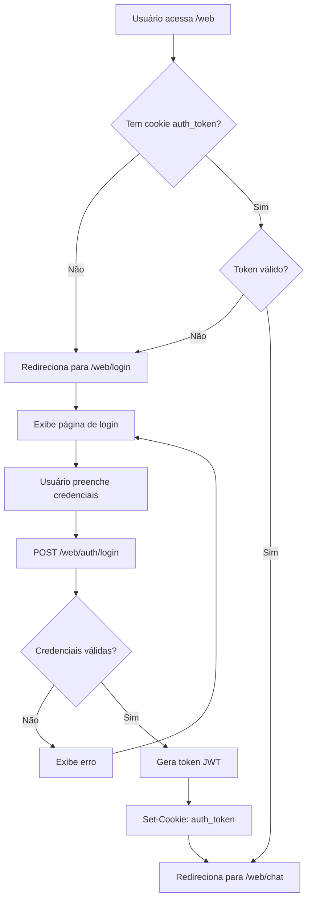
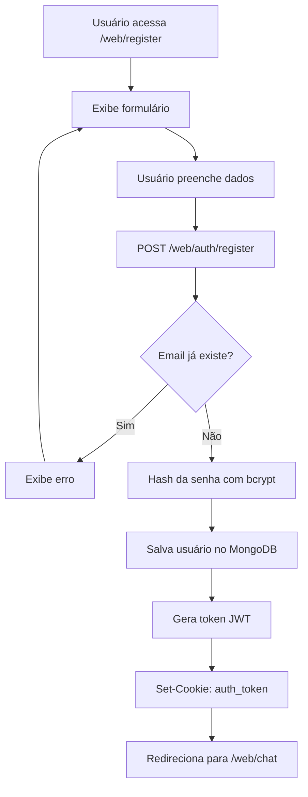
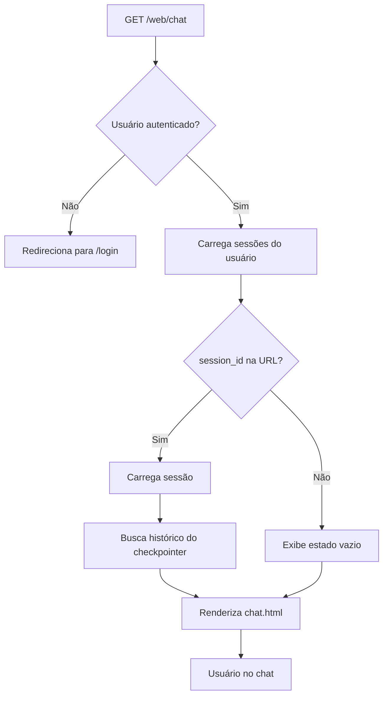
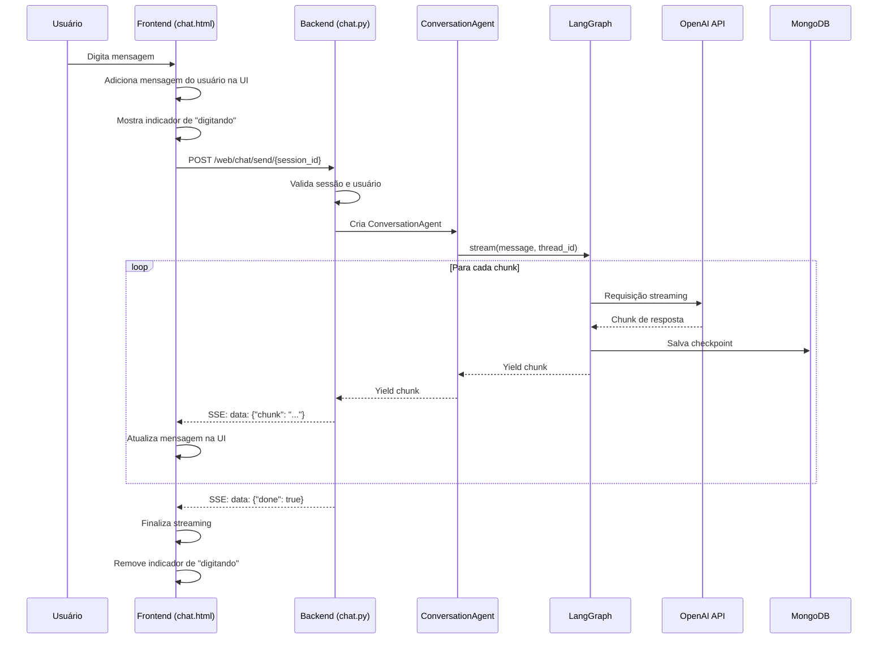
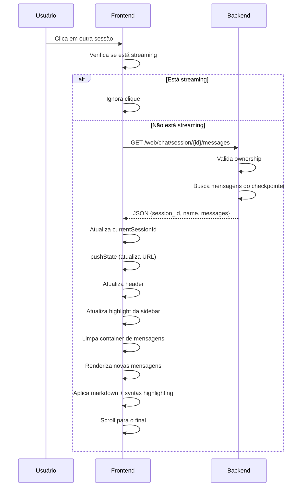
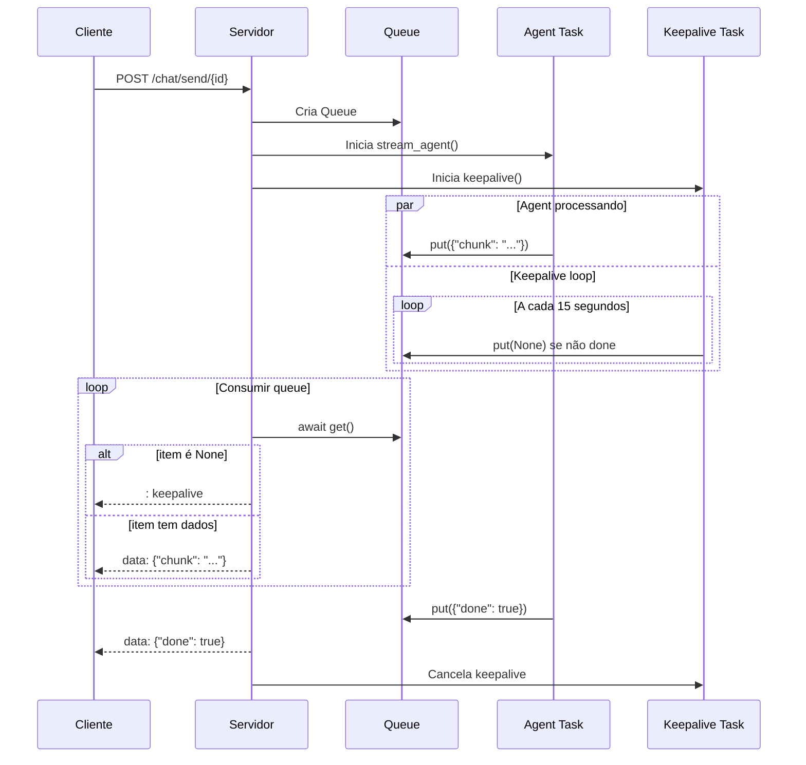
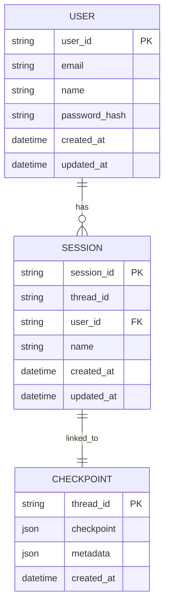
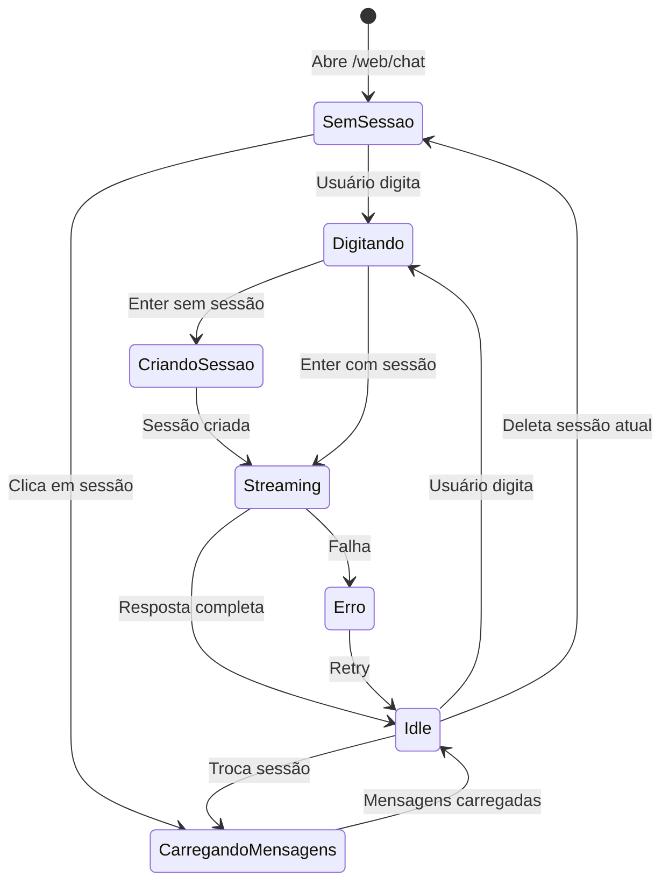
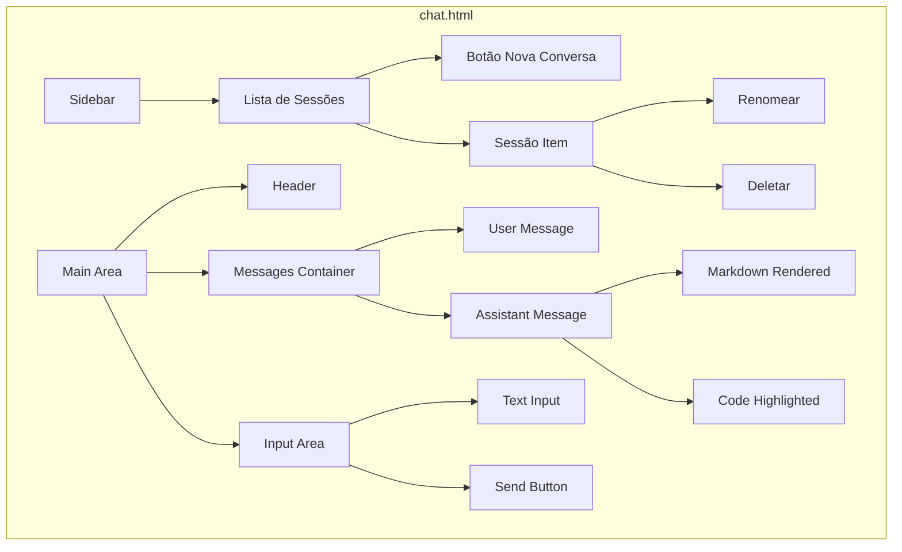
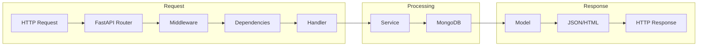

# Fluxos do Sistema

Este documento contém os diagramas de fluxo do módulo Web usando Mermaid.

## Fluxo Geral de Autenticação



## Fluxo de Registro



## Fluxo Principal do Chat



## Fluxo de Envio de Mensagem



## Fluxo de Criação Automática de Sessão

```mermaid
flowchart TD
    A[Usuário digita primeira mensagem] --> B{currentSessionId existe?}
    B -->|Sim| C[Envia mensagem normalmente]
    B -->|Não| D[POST /web/chat/session]
    D --> E[Cria sessão no MongoDB]
    E --> F[Retorna session_id]
    F --> G[Atualiza currentSessionId]
    G --> H[Atualiza URL com pushState]
    H --> I[Adiciona sessão na sidebar]
    I --> J[Esconde estado vazio]
    J --> C
    C --> K[POST /web/chat/send/{session_id}]
```

## Fluxo de Troca de Sessão (Sem Reload)



## Fluxo de Deleção de Sessão

```mermaid
flowchart TD
    A[Usuário clica em deletar] --> B[Confirmação]
    B -->|Cancela| C[Nada acontece]
    B -->|Confirma| D[DELETE /web/chat/session/{id}]
    D --> E[Backend valida ownership]
    E --> F[Deleta checkpoints do LangGraph]
    F --> G[Deleta sessão do MongoDB]
    G --> H{É a sessão atual?}
    H -->|Sim| I[Redireciona para /web/chat]
    H -->|Não| J[Remove elemento da sidebar]
```

## Fluxo de Streaming com Keep-alive



## Estrutura de Dados

### Sessão



## Estados do Chat



## Componentes do Frontend



## Ciclo de Vida da Requisição


